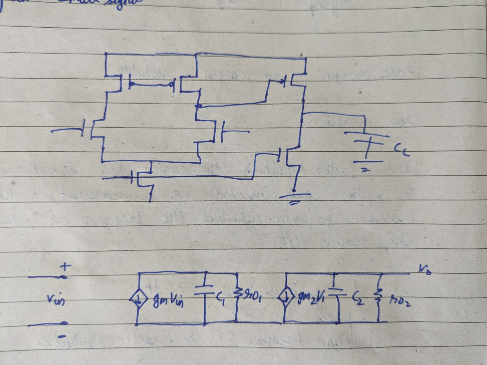
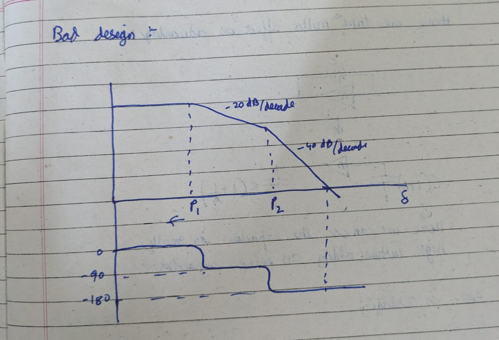
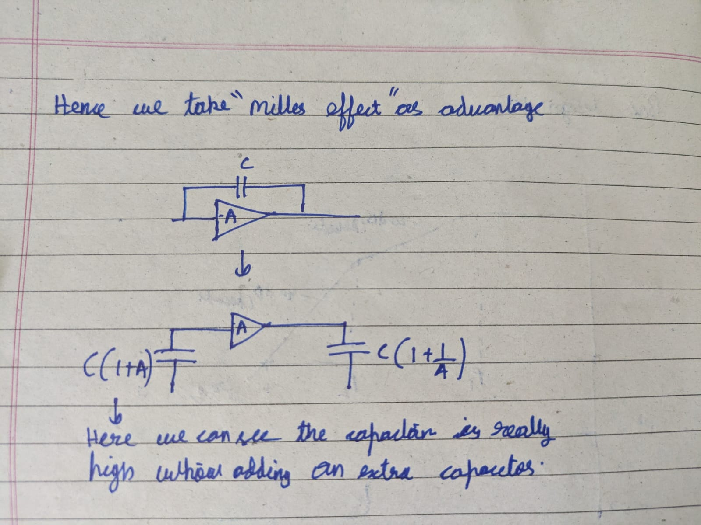
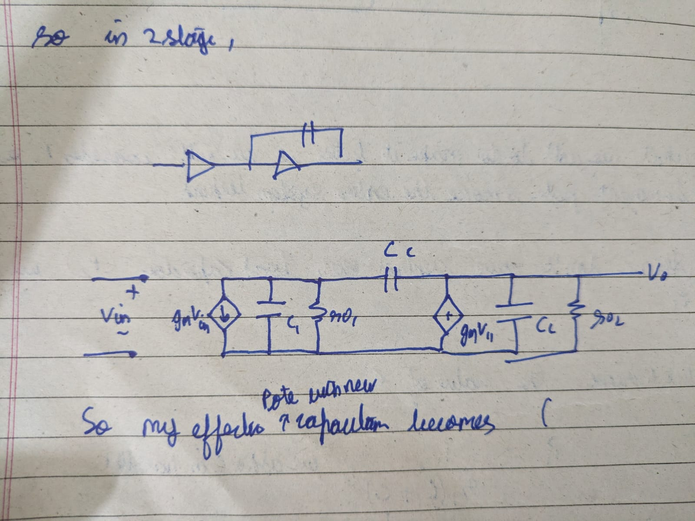
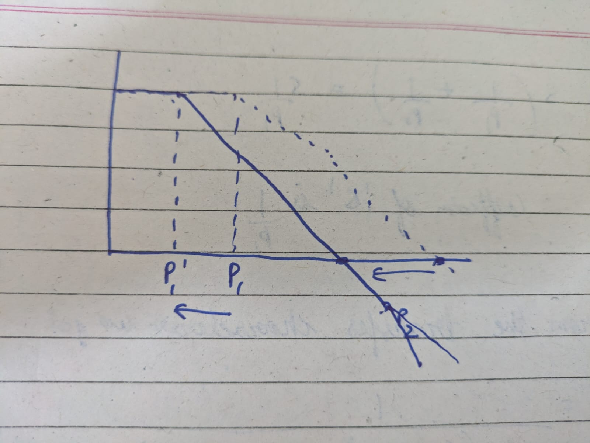

This project involves the design and simulation of a two-stage CMOS operational amplifier using Cadence Virtuoso. The design targets standard performance metrics such as DC gain, phase margin, and slew rate.

I will be going from the calculation of poles to optimizing the poles  for good phase margin

This project was done for one of my lab. Although I have no previous knowledge about the design of op amps ,I have watched some videos to understand how a 2 stage op amp is designed.

## Few questions which I would like to address

**Why not just use one stage?**

As per my understanding, the main reason is gain and output voltage swing.
We know that,

Av = gm · Rout

To make Av large enough to act like an ideal op-amp 
(60 dB to 80 dB+ or 1,000× to 10,000×), I have to either increase the transconductance or increase the Rout.

Increasing transconductance: means increasing the W/L ratio of the transistor ie large feature sizes or flushing out more ID  which leads to high area usage and more power consumption.

Increasing Rout: as I have studied in my Analog Electronics subject it is found out by considering small signal diagram and we can increase it by adding transistors(cascoding) which decreases the voltage swing of the Op-Amp.

**Why Common Source as the second stage?**

Now, after answering the first question we know that we want good output voltage swing and should have extra gain.

By using common source we have rail to rail swing. Along with this we also get good gain of 

Av2 = -gm1 (ro1 || ro2)

## Initial Circuit  and Small signal diagram

So the 2 stages are:
- Diffrential amplifier stage:
    Gives good common mode rejection and can amplify the diffrential input.
- Common source amplifier stage:
    Provides maximum Voltage swing and additional gain.

Here below is the basic diagram and effective small signal diagram

Here C1 refers to Cds of M4 and M2 and the gate capacitance of M6(input of CS).
The differential input voltage Vin acts on the transconductance of the input pair to generate an AC signal current.
The respective poles roughly are:

P1 = 1 / (ro1 · C1)

P2 = 1 / (ro2 · C2)

It is a 2 pole system as in small signal diagram there are 2 diffrent rc circuits.

## Bad design to good design

Above is a bode plot of a bad design. Why exactly is it bad?
Here comes the phase margin concept

When the circuit reaches Unity gain as shown in the plot above the phase is -180 which is not good.

Why? When we have a amplifier running it has certain phase lag of -180 degree, But when we increase freq so much additional phase lag is obsorved and that shoud not be greater than -180 degree.

Why? Beacuse it creates a positive feedback and the amplifier starts oscillating which we dont want to happen. A good design will have 45 to 60 degree of phase margin.

**Hence the above bode Plot is bad and I will say exactly how to make it better.**

We can make it better by playing with the position of poles. If you closely observe the P1 and P2 formula in the previous section we cant play a lot with P2 because it is dependent on load capacitance which can vary.

So P1 it is, 
How do we change the position such that our phase margin decreases?
We move the dominant pole to the left such that the crossover happens at a lower frequency which in turn decreases the phase margin.
P1 is our dominant pole now, and to increase there are 2 ways.

One add a capacitor C in parallel such that the effective pole becomes

P1 = 1 / (ro1 · (C1 + C))

This way we push the pole to the left but in order to shift enough we need a very large value of C. Hence we dont use it

**Second way is by using the concept of miller effect.**

Miller effect is the phenomeneon when the capacitance Cd  appears to be Cd = Cd (1+Av) in the input and Cd = Cd (1+1/Av)  Where Av is the gain of the amplifier. This happens when a capacitor is connected across input and output.

Looking at the input capacitance it is increased by a factor of (1 + Av) which is very big hence we will be able to shift the pole to the left properly.

Hence my new pole becomes,

P1 = 1 / (ro1 · (C1 + Cc(1+Av)))

The dominant pole P1 is pushed to the left and the non dominant pole P2 remains at the same place.
Thus the crossover frequency decreases. And we get appropiate phase margin.
If we look carefully the pole P2 occurs after the Crossover frequency hence it does not effect the fuctioning of the amplifier.

## Calculation of Poles and GBW

The full voltage transfer function of the two-stage Miller compensated operational amplifier is:

(We got this by analyzing the small signal diagram)

<table>
<tr>
<td rowspan="2"><b>Vo</b> / <b>Vin</b> = </td>
<td align="center" style="border-bottom: 1px solid;">gm1R1 · gm2R2 · (1 - s · Cc / gm2)</td>
</tr>
<tr>
<td align="center">s2 · [R1R2(C1C2 + C1Cc + C2Cc)] + s · [R2(C1 + C2) + R1(Cc + C1) + Ccgm2R1R2] + 1</td>
</tr>
</table>
General 2-Pole Transfer Function Approximation
The generic expression for a stable system with two low-frequency poles and a right-half-plane zero is:
<table>
<tr>
<td rowspan="2"><b>Vo</b> / <b>Vin</b> = </td>
<td align="center" style="border-bottom: 1px solid;">ADC · (1 - s / z)</td>
</tr>
<tr>
<td align="center">(1 + s / P1)(1 + s / P2)</td>
</tr>
</table>
<table>
<tr>
<td rowspan="2">= </td>
<td align="center" style="border-bottom: 1px solid;">ADC · (1 - s / z)</td>
</tr>
<tr>
<td align="center">1 + s · (1 / P1 + 1 / P2) + s2 · (1 / (P1P2))</td>
</tr>
</table>
As P2 is really far away, 1 / P2 will be exceptionally small. Therefore, the dominant terms simplify as follows:

s · (1 / P1 + 1 / P2) ≈ s · (1 / P1)

The dominant coefficient of 's' becomes 1 / P1.
Dominant Pole (P1) Derivation
By equating the linear 's' term from the main transfer function denominator to our approximation:
<table>
<tr>
<td rowspan="2"><b>P1</b> = </td>
<td align="center" style="border-bottom: 1px solid;">1</td>
</tr>
<tr>
<td align="center">R2(C1 + CL) + R1(Cc + C1) + gm2R2R1Cc</td>
</tr>
</table>
Because the Miller multiplication term (gm2R2R1Cc) is far larger than the individual parasitic pole terms, the expression simplifies to the standard dominant pole equation:
<table>
<tr>
<td rowspan="2"><b>P1</b> ≈ </td>
<td align="center" style="border-bottom: 1px solid;">1</td>
</tr>
<tr>
<td align="center">gm2R2R1Cc</td>
</tr>
</table>
Non-Dominant Pole (P2) Derivation
Now look at the coefficient of 's2', which matches 1 / (P1P2):
<table>
<tr>
<td rowspan="2"><b>P1P2</b> = </td>
<td align="center" style="border-bottom: 1px solid;">1</td>
</tr>
<tr>
<td align="center">R1R2(C1C2 + C1Cc + C2Cc)</td>
</tr>
</table>
To isolate P2, we multiply the inverse of the 's2' coefficient by our calculated P1 value:
<table>
<tr>
<td rowspan="2"><b>P2</b> = </td>
<td align="center" style="border-bottom: 1px solid;">1</td>
<td rowspan="2">  ×  gm2R2R1Cc</td>
</tr>
<tr>
<td align="center">R1R2(C1C2 + C1Cc + C2Cc)</td>
</tr>
</table>
Assuming the load capacitance C2 (or CL) is substantially larger than the internal stage node parasitic capacitance C1, the equation simplifies perfectly to:
<table>
<tr>
<td rowspan="2"><b>P2</b> ≈ </td>
<td align="center" style="border-bottom: 1px solid;">gm2</td>
</tr>
<tr>
<td align="center">C2</td>
</tr>
</table>
DC Open Loop Gain (ADC)
When all high-frequency elements drop to zero (s = 0), the total low frequency DC voltage gain is:

ADC = gm1R1 · gm2R2

Gain Bandwidth Product (GBW)
The total gain bandwidth product of our two-stage feedback network is defined as the absolute open-loop DC Gain multiplied by the dominant corner pole frequency (*P1*):

GBW = DC Gain × P1

<table>
<tr>
<td rowspan="2"><b>GBW</b> = (gm1R1 · gm2R2)  ×  </td>
<td align="center" style="border-bottom: 1px solid;">1</td>
</tr>
<tr>
<td align="center">gm2R2R1Cc</td>
</tr>
</table>
<table>
<tr>
<td rowspan="2"><b>GBW</b> = </td>
<td align="center" style="border-bottom: 1px solid;">gm1</td>
</tr>
<tr>
<td align="center">Cc</td>
</tr>
</table>

---
## Design Specifications
| Parameter             | Target Value |
|-----------------------|-------------|
| Supply Voltage (VDD)  | 1.8 V       |
| DC Open-Loop Gain     | ≥ 60 dB     |
| Unity-Gain Bandwidth  | ≥ 10 MHz    |
| Phase Margin          | ≥ 60°       |
| Slew Rate             | ≥ 10 V/µs   |
| Power Dissipation     | ≤ 1 mW      |
---
## Transistor Sizing
| Transistor | W (µm) | L (nm) | Type  |
|------------|--------|--------|-------|
| M1, M2     | 10     | 180    | PMOS  |
| M3, M4     | 5      | 180    | NMOS  |
| M5         | 4      | 180    | NMOS  |
| M6         | 20     | 180    | NMOS  |
| M7, M8     | 4      | 180    | NMOS  |
Compensation: **Cc = 3 pF**, **Rc = 500 Ω**
---