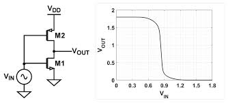

This project involves the design and simulation of a **two-stage CMOS operational amplifier** using Cadence Virtuoso. The design targets standard performance metrics such as DC gain, phase margin, and slew rate.

I will be going from the calculation of poles to optimizing the poles  for good phase margin

This project was done for one of my lab. Although I have no previous knowledge about the design of op amps ,I have watched some videos to understand how a 2 stage op amp is designed.

## Few questions which I would like to address

**Why not just use one stage?**

As per my understanding, the main reason is gain and output voltage swing.
We know that,

Av = gm · Rout

To make Av large enough to act like an ideal op-amp 
(60 dB to 80 dB+ or 1,000× to 10,000×), I have to either increase the transconductance or increase the Rout.

Increasing transconductance: means increasing the W/L ratio of the transistor ie large feature sizes or flushing out more ID  which leads to high area usage and more power consumption.

Increasing Rout: as I have studied in my Analog Electronics subject it is found out by considering small signal diagram and we can increase it by adding transistors(cascoding) which decreases the voltage swing of the Op-Amp.

**Why Common Source as the second stage?**

Now, after answering the first question we know that we want good output voltage swing and should have extra gain.

By using common source we have rail to rail swing. Along with this we also get good gain of 

Av2 = -gm1 (ro1 || ro2)

## Initial Circuit  and Small signal diagram

So the 2 stages are:
- Diffrential amplifier stage:
    Gives good common mode rejection and can amplify the diffrential input.
- Common source amplifier stage:
    Provides maximum Voltage swing and additional gain.

---
## Design Specifications
| Parameter             | Target Value |
|-----------------------|-------------|
| Supply Voltage (VDD)  | 1.8 V       |
| DC Open-Loop Gain     | ≥ 60 dB     |
| Unity-Gain Bandwidth  | ≥ 10 MHz    |
| Phase Margin          | ≥ 60°       |
| Slew Rate             | ≥ 10 V/µs   |
| Power Dissipation     | ≤ 1 mW      |
---
## Transistor Sizing
| Transistor | W (µm) | L (nm) | Type  |
|------------|--------|--------|-------|
| M1, M2     | 10     | 180    | PMOS  |
| M3, M4     | 5      | 180    | NMOS  |
| M5         | 4      | 180    | NMOS  |
| M6         | 20     | 180    | NMOS  |
| M7, M8     | 4      | 180    | NMOS  |
Compensation: **Cc = 3 pF**, **Rc = 500 Ω**
---